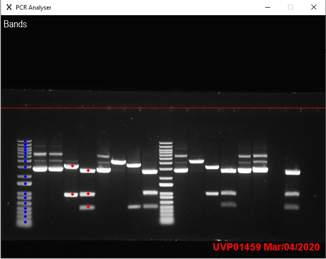
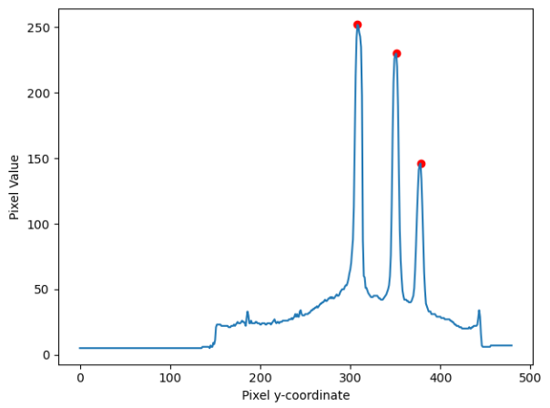
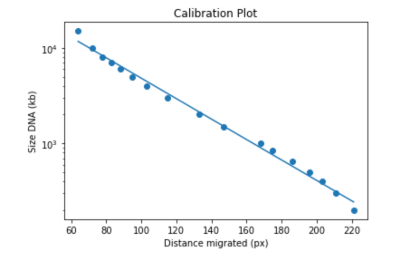
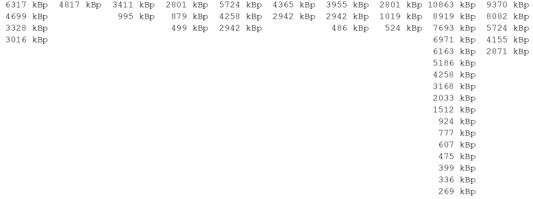

# Gel Electrophoresis Analyser

## Introduction
The Gel Electrophoresis Analyser project consists of two complementary parts:
1. The Interface
2. The Analysis Notebook

The interface is a UI to allow the user to select the bands they want to analyse and output the data in a usable format. The
analysis notebook is a jupyter notebook that can be used to then analyse the data produced by the interface. The data can be
used to determine the fragment sizes of the band on the gel.

## The Interface
Contained within the Interface.py file is the interface for the analyser. This is a simple windowed application to allow the user
to visually select bands and markers.



The interface helps the user extract 3 key data from the gel image:
1. The pixel y-coordinate of the wells.
2. The pixel coordinates of the marker bands.
3. The pixel coordinates of the analysis bands.

The data currently being selected is displayed in the top-left hand corner of the interface. The well position when selected
is visualised with a red line across the display. The marker band positions are denoted with blue dots and those of the bands
to analyse are denoted with red dots. The data to select can be switched between using the "w" key for wells position, "m" for
the markers and "b" for the bands.

#### Band Detection

When the data being selected is on markers or bands the user only has to click roughly in the central x-position of the well. The
program will then pick out the bands. This is done by converting the image to an 8-bit grayscale pixel array and at a series of intervals from
the mouse selected x-position single pixel bands are extracted. Peaks in the average pixel value at any particular y-position are used to detect bands.
Peaks in the data are found using the SciPy scipy.signal.find_peaks() method. This takes a few parameters which can be tweeked in order to optimise
the band detection.

```
BRIGHTNESS_THRESHOLD = 80
PEAK_WIDTH = 2
PEAK_SEPARATION = 4
OFFSET = 1
INTERVALS = 7
```

* Brightness threshold - determines the minimum pixel value for a peak
* Peak width and separation and the width of the peak and the distance between peaks, fairly self explanatory
* Intervals - the number of single dimension pixel strips taken from the image when a well is clicked.
* Offset - the space in pixels between the intervals.

The intervals and offset are used to produce multiple x-coordinates to average from when a well is clicked. These x-coordinates are
generated using a list comprehension as follows:
```
x_samples = [mouse_x - OFFSET + OFFSET * i for i in range(INTERVALS * 2 + 1)]
```

The pixel values can be plotted against the pixel y-coordinate to visualise the peaks. The graph for each selected well is produced by the _GraphBandDetection() method.
The peaks produced by the find_peaks() method can be plotted using a scatter plot on top of the first plot. The graph can then be used to aid the adjustment of the variables
used for finding the peaks.

*NB: A common issue with the band detection is that the program will place two bands on on top of the other. This is because two peaks have been detected. This can be avoided by increasing the
peak width and separation. However, this may then lead to some of the marker bands not being detected as the marker bands are close together and merge into one another slightly.*



#### Output

Once all the relevant data has been selected in the interface, the return key can be pressed which will close the interface. If the interface is being run as `__main__`
then the program will output a results.pickle file containing the serialised data which can then be read and analysed. However if the OpenUI() function has been called from
another script then the function will return the data from the interface.

## The Analysis

Paired with the Interface.py script is a jupyter notebook, Analysis.ipynb, which allows for analysis of the data produced by the interface. The notebook contains code to describe the data
produced and then to analyse it to ultimately produce a calibration plot. In order to do this the user must supply the fragment sizes used for the markers. This is
contained within the `SIZE MARKERS` variable. The calibration plot produced is a semi-log plot to create an easily readable straight line.



The band sizes are also displayed in print format so that size of each band can be easily distinguished.


